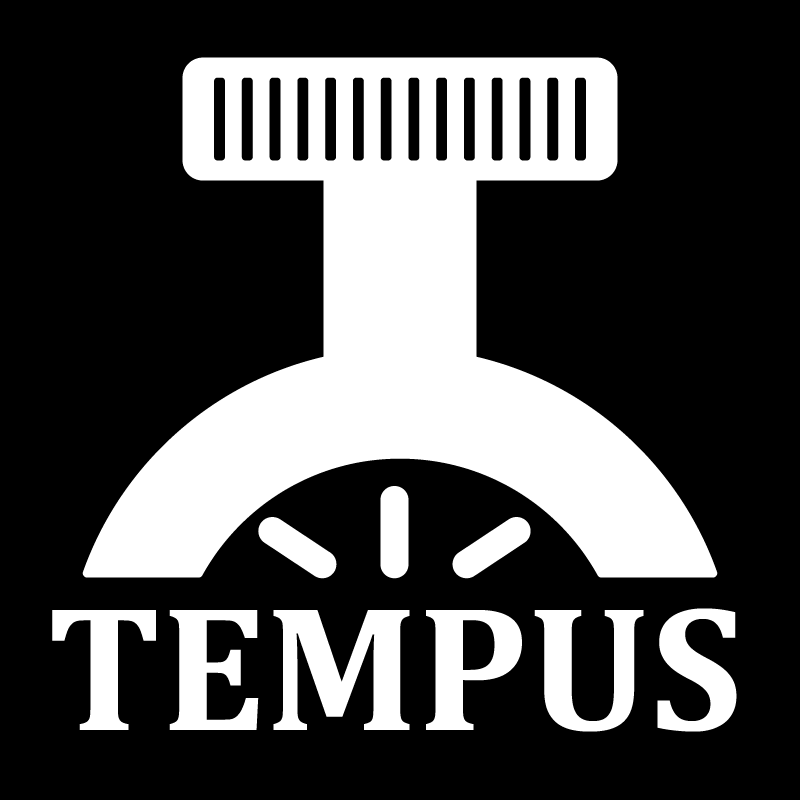

 

  

  <h3 align="center" style="font-size:6vw; font-weight: bold;">Tempus</h3>

  

    A cross-platform 3D Vulkan game engine written entirely in C++
     
    Created by Levi Spevakow
     
     
  

## About the project
 Tempus is a project I embarked on to deepen my knowledge of various concepts I strive to master, all relating or pertaining to game engines.

 My goals can be broken into three main categories:

 1. Improve my general software engineering and architectural skills.
 2. Build a stronger foundational understanding of game engine architecture.
 3. Broaden my understanding of how graphics pipelines work, specifically on modern devices.

## Building the project
 1. Ensure Vulkan SDK is properly installed on your device
 2. Run GenerateProjects.bat
 3. Build Tempus, then Sandbox